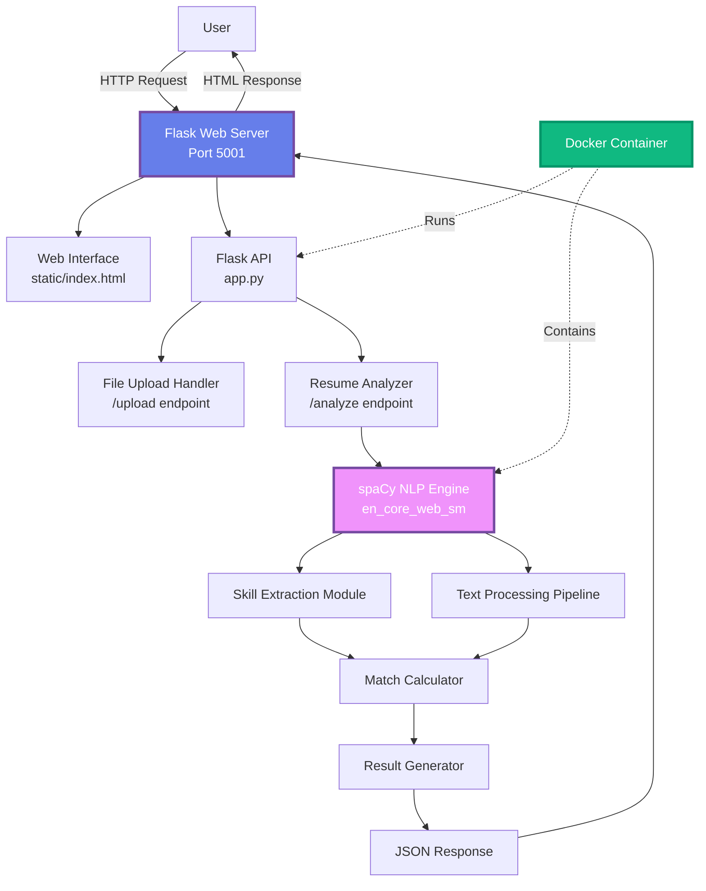
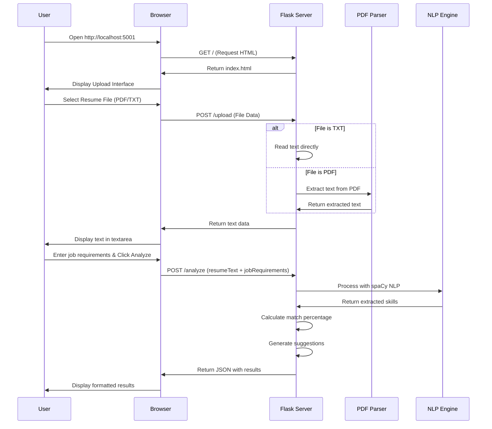
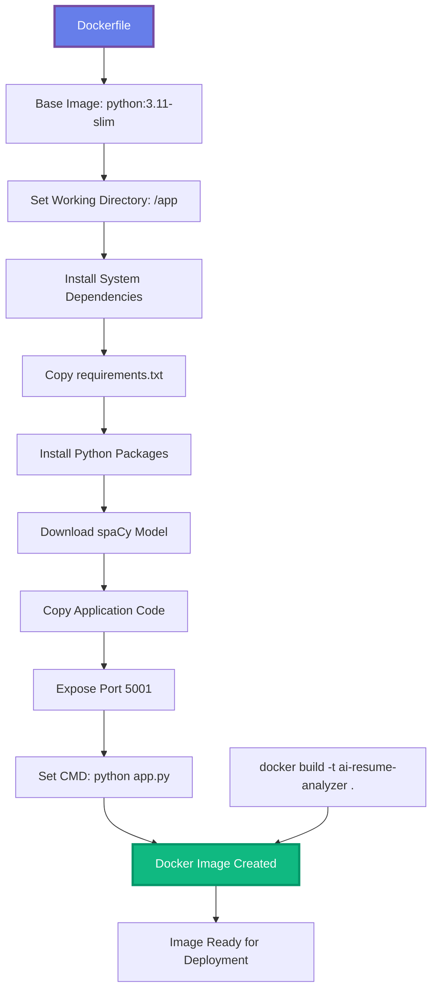
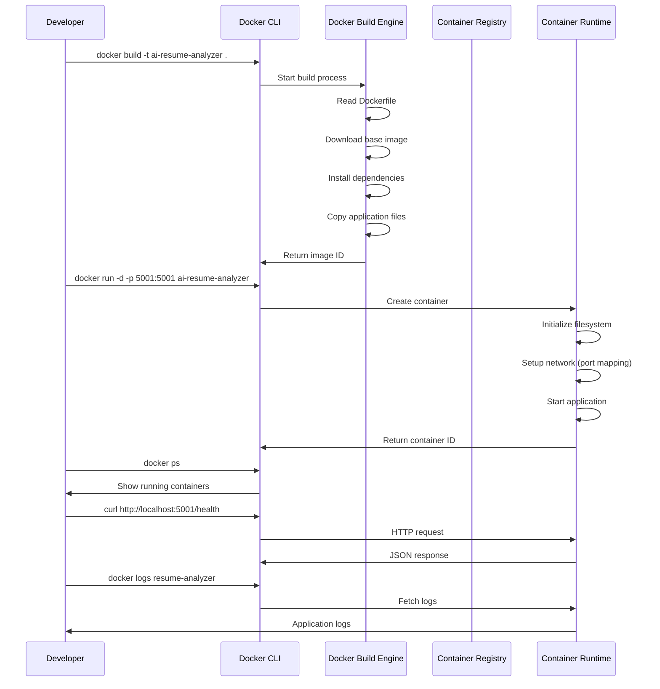
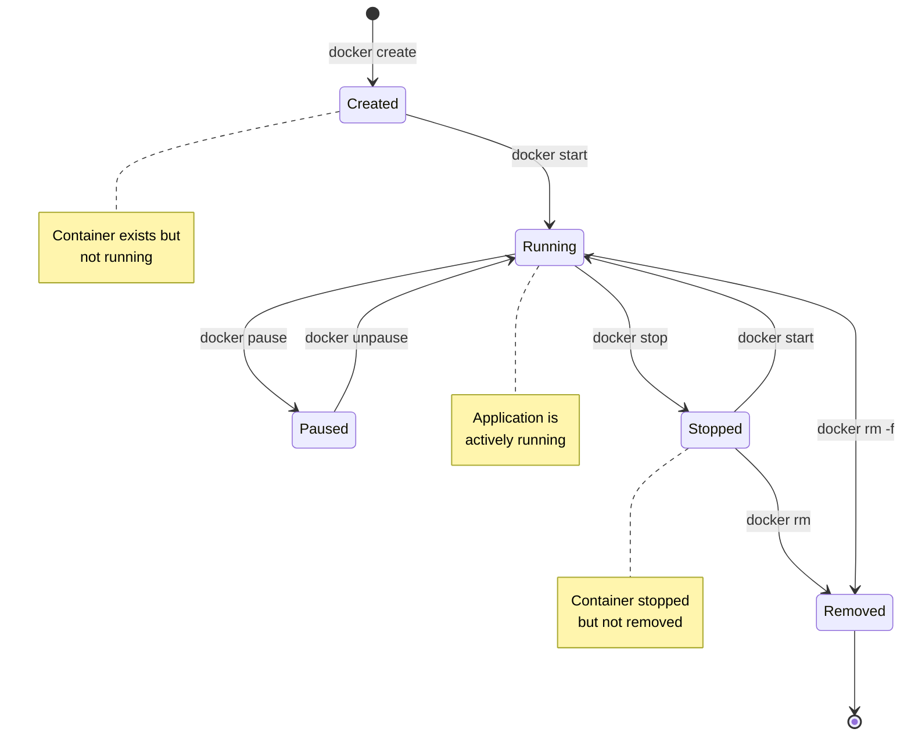
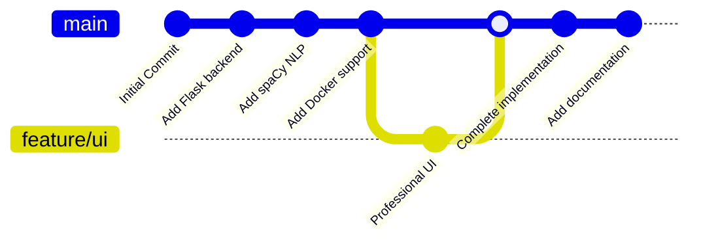
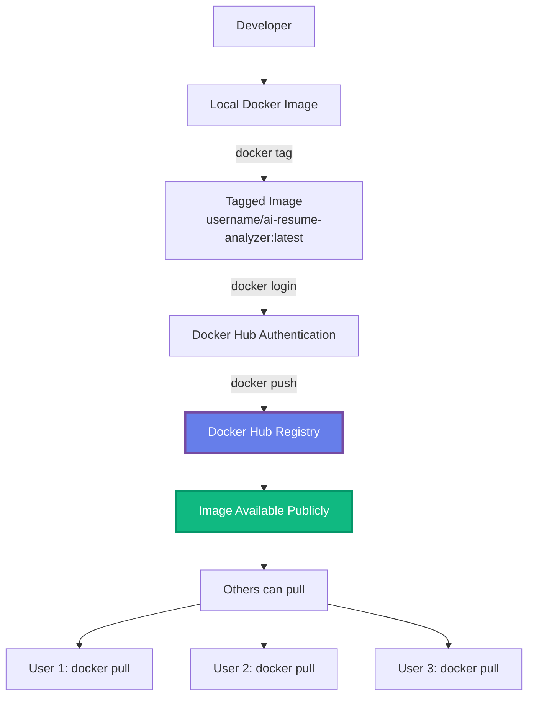

# 📊 Report Figures - AI-Powered Resume Analyzer

## Complete Set of Figures for Project Report

---

## Figure 2.1: System Architecture of Resume Analyzer



### ASCII Version:
```
┌─────────────────────────────────────────────────────────┐
│                    SYSTEM ARCHITECTURE                   │
└─────────────────────────────────────────────────────────┘

    [User Browser]
         │
         │ HTTP Request
         ▼
┌────────────────────────────────────────────────────┐
│  Flask Web Server (Port 5001)                      │
│  ┌─────────────────┐  ┌──────────────────┐       │
│  │ Web Interface   │  │  Flask API       │       │
│  │ (HTML/CSS/JS)   │  │  (app.py)        │       │
│  └─────────────────┘  └──────────────────┘       │
│           │                    │                   │
└───────────┼────────────────────┼───────────────────┘
            │                    │
            │                    ▼
            │          ┌────────────────────┐
            │          │ File Upload Handler│
            │          └────────────────────┘
            │                    │
            │                    ▼
            │          ┌────────────────────┐
            │          │ Resume Analyzer    │
            │          └────────────────────┘
            │                    │
            └────────────────────┼──────────────────┐
                                 │                  │
                                 ▼                  ▼
                    ┌──────────────────┐  ┌──────────────────┐
                    │  spaCy NLP       │  │  Text Processing │
                    │  Engine          │  │  Pipeline        │
                    └──────────────────┘  └──────────────────┘
                                 │                  │
                                 └──────────┬───────┘
                                            ▼
                                 ┌──────────────────┐
                                 │ Skill Extraction │
                                 │ & Matching       │
                                 └──────────────────┘
                                            │
                                            ▼
                                 ┌──────────────────┐
                                 │ Result Generator │
                                 └──────────────────┘
                                            │
                                            ▼
                                 [JSON Response]
                                            │
                                            └───► [User Browser]

┌──────────────────────────────────────────────────────────┐
│  Docker Container Environment                             │
│  ┌────────────────────────────────────────────────────┐  │
│  │  Python 3.11 + Flask + spaCy + Application Code  │  │
│  └────────────────────────────────────────────────────┘  │
└──────────────────────────────────────────────────────────┘
```

---

## Figure 2.2: Resume Upload Interface in Flask



### ASCII Flow Diagram:
```
RESUME UPLOAD INTERFACE FLOW

┌──────────┐
│   User   │
└────┬─────┘
     │
     │ 1. Access http://localhost:5001
     ▼
┌─────────────────────────────────────┐
│      Web Browser                    │
│  ┌───────────────────────────────┐ │
│  │  Flask Upload Interface        │ │
│  │  ┌──────────────────────────┐ │ │
│  │  │ [Choose File] Button      │ │ │
│  │  │  📄 Upload Resume         │ │ │
│  │  └──────────────────────────┘ │ │
│  │  ┌──────────────────────────┐ │ │
│  │  │ Resume Text Area         │ │ │
│  │  │ [Paste or uploaded text] │ │ │
│  │  └──────────────────────────┘ │ │
│  │  ┌──────────────────────────┐ │ │
│  │  │ Job Requirements         │ │ │
│  │  └──────────────────────────┘ │ │
│  │  ┌──────────────────────────┐ │ │
│  │  │ [🚀 Analyze Resume]      │ │ │
│  │  └──────────────────────────┘ │ │
│  └───────────────────────────────┘ │
└──────────┬──────────────────────────┘
           │
           │ 2. Upload File
           ▼
┌─────────────────────────────────────┐
│      Flask Server                    │
│  ┌──────────────────────────────┐   │
│  │ POST /upload                  │   │
│  │  - Receive file               │   │
│  │  - Extract text (PDF/TXT)     │   │
│  │  - Return text to browser     │   │
│  └──────────────────────────────┘   │
│           │                           │
│           │ 3. User Clicks Analyze    │
│           ▼                           │
│  ┌──────────────────────────────┐   │
│  │ POST /analyze                │   │
│  │  - Process with NLP          │   │
│  │  - Calculate match           │   │
│  │  - Generate suggestions      │   │
│  │  - Return JSON results       │   │
│  └──────────────────────────────┘   │
└─────────────────────────────────────┘
           │
           │ 4. Display Results
           ▼
┌─────────────────────────────────────┐
│   Results Display                    │
│  - Match Percentage (Large)         │
│  - Matched Skills (Green badges)    │
│  - Missing Skills (Red badges)      │
│  - Suggestions (Yellow card)        │
└─────────────────────────────────────┘
```

---

## Figure 2.3: NLP Text Processing Pipeline

```mermaid
flowchart LR
    A[Raw Resume Text] --> B[Text Preprocessing]
    B --> C[spaCy Tokenization]
    C --> D[Part-of-Speech Tagging]
    C --> E[Named Entity Recognition]
    D --> F[Pattern Matching]
    E --> F
    F --> G[Skill Extraction]
    G --> H[Technical Skills List]
    G --> I[Soft Skills List]
    H --> J[Skill Normalization]
    I --> J
    J --> K[Matched Skills]
    J --> L[Missing Skills]
    K --> M[Final Analysis]
    L --> M
    M --> N[Match Percentage]
    M --> O[Suggestions]
    
    style A fill:#e0e7ff
    style C fill:#f093fb,stroke:#764ba2,stroke-width:3px,color:#fff
    style G fill:#667eea,stroke:#764ba2,stroke-width:3px,color:#fff
    style M fill:#10b981,stroke:#059669,stroke-width:3px,color:#fff
```



### Detailed Pipeline Diagram:
```
NLP TEXT PROCESSING PIPELINE

┌─────────────────────────────────────────────────────────────┐
│                   INPUT LAYER                               │
│  Raw Resume Text: "Software Engineer with Python,          │
│  Flask, Docker experience. Strong problem-solving..."      │
└─────────────────────┬───────────────────────────────────────┘
                      │
                      ▼
┌─────────────────────────────────────────────────────────────┐
│              PREPROCESSING LAYER                            │
│  - Lowercase conversion                                     │
│  - Special character handling                               │
│  - Whitespace normalization                                 │
└─────────────────────┬───────────────────────────────────────┘
                      │
                      ▼
┌─────────────────────────────────────────────────────────────┐
│            spaCy NLP PROCESSING LAYER                       │
│  ┌──────────────────────────────────────────────────────┐  │
│  │ Tokenization: Split into words/tokens                │  │
│  │  ["Software", "Engineer", "with", "Python", ...]      │  │
│  └──────────────────────────────────────────────────────┘  │
│  ┌──────────────────────────────────────────────────────┐  │
│  │ POS Tagging: Identify parts of speech               │  │
│  │  Software/NNP Engineer/NNP Python/NNP ...            │  │
│  └──────────────────────────────────────────────────────┘  │
│  ┌──────────────────────────────────────────────────────┐  │
│  │ Named Entity Recognition: Extract entities          │  │
│  │  ORG: "Software", PRODUCT: "Python", "Flask"        │  │
│  └──────────────────────────────────────────────────────┘  │
└─────────────────────┬───────────────────────────────────────┘
                      │
                      ▼
┌─────────────────────────────────────────────────────────────┐
│              PATTERN MATCHING LAYER                         │
│  - Technical skills patterns (Python, Flask, Docker)        │
│  - Soft skills patterns (problem-solving, communication)   │
│  - Education keywords (Bachelor, Master, University)        │
│  - Experience keywords (years, experience, worked)          │
└─────────────────────┬───────────────────────────────────────┘
                      │
                      ▼
┌─────────────────────────────────────────────────────────────┐
│            SKILL EXTRACTION LAYER                            │
│  Technical Skills: [Python, Flask, Docker, Git]            │
│  Soft Skills: [Problem-solving, Communication]              │
│  Experience: "5+ years software engineering"               │
│  Education: "Bachelor's in Computer Science"                │
└─────────────────────┬───────────────────────────────────────┘
                      │
                      ▼
┌─────────────────────────────────────────────────────────────┐
│              MATCHING & ANALYSIS LAYER                       │
│  Job Requirements: [Python, Flask, Docker, ML]             │
│  Extracted Skills: [Python, Flask, Docker, Git]            │
│  ┌──────────────────────────────────────────────────────┐  │
│  │ Matched: [Python, Flask, Docker] → 75% match        │  │
│  │ Missing: [Machine Learning]                          │  │
│  └──────────────────────────────────────────────────────┘  │
└─────────────────────┬───────────────────────────────────────┘
                      │
                      ▼
┌─────────────────────────────────────────────────────────────┐
│                    OUTPUT LAYER                             │
│  - Match Percentage: 75%                                    │
│  - Matched Skills: Python, Flask, Docker                   │
│  - Missing Skills: Machine Learning                        │
│  - Suggestions: "Focus on ML skills", "Add ML projects"     │
└─────────────────────────────────────────────────────────────┘
```

---

## Figure 3.1: Dockerfile and Build Configuration



### Dockerfile Structure:
```
┌────────────────────────────────────────────────────────────┐
│                    DOCKERFILE STRUCTURE                    │
└────────────────────────────────────────────────────────────┘

FROM python:3.11-slim          ┌─────────────────────────┐
    │                         │  Base Linux Image      │
    │                         │  (Ubuntu-based)        │
    ▼                         └─────────────────────────┘
WORKDIR /app                   ┌─────────────────────────┐
    │                         │  Set Working Directory │
    │                         │  All files copied here │
    ▼                         └─────────────────────────┘
RUN apt-get update && \        ┌─────────────────────────┐
    apt-get install -y gcc    │  Install System Deps    │
    │                         │  (for Python packages)  │
    ▼                         └─────────────────────────┘
COPY requirements.txt .        ┌─────────────────────────┐
    │                         │  Copy Dependencies File │
    │                         │  (Flask, spaCy, etc.)   │
    ▼                         └─────────────────────────┘
RUN pip install -r \          ┌─────────────────────────┐
    requirements.txt          │  Install Python Packages│
    │                         │  Flask, flask-cors,     │
    │                         │  spacy, PyPDF2          │
    ▼                         └─────────────────────────┘
RUN python -m spacy download \┌─────────────────────────┐
    en_core_web_sm            │  Download NLP Model     │
    │                         │  (English language)     │
    ▼                         └─────────────────────────┘
COPY app.py .                 ┌─────────────────────────┐
COPY static/ ./static/        │  Copy Application Code  │
    │                         │  - Flask app (app.py)   │
    │                         │  - Web UI (static/)     │
    ▼                         └─────────────────────────┘
EXPOSE 5001                   ┌─────────────────────────┐
    │                         │  Expose Port            │
    │                         │  (Container port)      │
    ▼                         └─────────────────────────┘
CMD ["python", "app.py"]      ┌─────────────────────────┐
                              │  Start Command          │
                              │  (Runs on container start)│
                              └─────────────────────────┘

┌────────────────────────────────────────────────────────────┐
│              BUILD PROCESS                                 │
│  $ docker build -t ai-resume-analyzer .                   │
│                                                            │
│  Step 1/8 : FROM python:3.11-slim                         │
│  Step 2/8 : WORKDIR /app                                   │
│  Step 3/8 : RUN apt-get update ...                        │
│  Step 4/8 : COPY requirements.txt .                        │
│  Step 5/8 : RUN pip install ...                            │
│  Step 6/8 : RUN python -m spacy download ...              │
│  Step 7/8 : COPY . .                                      │
│  Step 8/8 : EXPOSE 5001                                   │
│                                                            │
│  Successfully built abc123def456                          │
│  Successfully tagged ai-resume-analyzer:latest            │
└────────────────────────────────────────────────────────────┘
```

---

## Figure 3.2: Building and Testing Docker Container



### Command Flow Diagram:
```
BUILDING AND TESTING DOCKER CONTAINER

┌─────────────────────────────────────────────────────────────┐
│                    STEP 1: BUILD IMAGE                     │
└─────────────────────────────────────────────────────────────┘

Developer Terminal:
$ docker build -t ai-resume-analyzer .

┌─────────────────────────────────────────────────────────────┐
│  Docker Build Process:                                     │
│  ┌──────────────────────────────────────────────────────┐  │
│  │ Step 1: Pull base image (python:3.11-slim)          │  │
│  │ Step 2: Set working directory                        │  │
│  │ Step 3: Install system dependencies                   │  │
│  │ Step 4: Install Python packages                      │  │
│  │ Step 5: Download spaCy model                         │  │
│  │ Step 6: Copy application code                       │  │
│  │ Step 7: Configure port exposure                      │  │
│  └──────────────────────────────────────────────────────┘  │
│                                                            │
│  ✓ Successfully built abc123def456                        │
│  ✓ Successfully tagged ai-resume-analyzer:latest          │
└─────────────────────────────────────────────────────────────┘

┌─────────────────────────────────────────────────────────────┐
│                  STEP 2: RUN CONTAINER                     │
└─────────────────────────────────────────────────────────────┘

Developer Terminal:
$ docker run -d -p 5001:5001 --name resume-analyzer ai-resume-analyzer

┌─────────────────────────────────────────────────────────────┐
│  Container Runtime:                                        │
│  ┌──────────────────────────────────────────────────────┐  │
│  │ • Create isolated filesystem                         │  │
│  │ • Setup network namespace                            │  │
│  │ • Map port 5001:5001 (host:container)               │  │
│  │ • Start process: python app.py                       │  │
│  │ • Container ID: 789xyz...                           │  │
│  └──────────────────────────────────────────────────────┘  │
└─────────────────────────────────────────────────────────────┘

┌─────────────────────────────────────────────────────────────┐
│                STEP 3: VERIFY CONTAINER                     │
└─────────────────────────────────────────────────────────────┘

$ docker ps
CONTAINER ID   IMAGE                STATUS         PORTS
789xyz123      ai-resume-analyzer   Up 2 minutes   0.0.0.0:5001->5001/tcp

┌─────────────────────────────────────────────────────────────┐
│                   STEP 4: TEST APPLICATION                  │
└─────────────────────────────────────────────────────────────┘

$ curl http://localhost:5001/health
{
  "status": "healthy",
  "spacy_loaded": true,
  "pdf_support": true,
  "message": "AI-Powered Resume Analyzer API is running"
}

✓ Container is running successfully!
✓ Application is accessible!
✓ Health check passed!
```

---

## Figure 3.3: Docker Container Lifecycle



### Lifecycle Diagram:
```
DOCKER CONTAINER LIFECYCLE

                    [NO CONTAINER]
                          │
                          │ docker create
                          ▼
┌─────────────────────────────────────────┐
│         CREATED                         │
│  • Container created                    │
│  • Filesystem initialized              │
│  • Not running                          │
│  • Can be started                       │
└──────────────┬──────────────────────────┘
               │
               │ docker start
               ▼
┌─────────────────────────────────────────┐
│         RUNNING                         │
│  • Application executing                │
│  • Ports accessible                     │
│  • Processing requests                  │
│  • Logs being generated                 │
└─────┬──────────────────────┬────────────┘
      │                      │
      │ docker pause         │ docker stop
      │                      │
      ▼                      ▼
┌──────────────┐    ┌────────────────────┐
│   PAUSED     │    │      STOPPED       │
│  • Suspended │    │  • Not running     │
│  • State     │    │  • Can be restarted│
│    preserved │    │  • Data preserved  │
└──────┬───────┘    └──────────┬─────────┘
       │                       │
       │ docker unpause        │ docker start
       │                       │
       └───────────┬───────────┘
                   │
                   ▼
┌─────────────────────────────────────────┐
│         RUNNING (again)                  │
└──────────────────────────────────────────┘

                      │
                      │ docker rm
                      │ (force remove)
                      ▼
┌─────────────────────────────────────────┐
│         REMOVED                         │
│  • Container deleted                    │
│  • Data lost (unless volumes used)     │
│  • Back to initial state                │
└──────────────────────────────────────────┘
                      │
                      ▼
                [NO CONTAINER]

COMMAND SUMMARY:
─────────────────────────────────────────────────────────
State Transition          Command
─────────────────────────────────────────────────────────
→ Created                 docker create
Created → Running         docker start
Running → Paused          docker pause
Paused → Running          docker unpause
Running → Stopped         docker stop
Stopped → Running         docker start
Running → Removed         docker rm -f
Stopped → Removed         docker rm
─────────────────────────────────────────────────────────
```

---

## Figure 3.4: GitHub Repository Upload Workflow



### Git Workflow Diagram:
```
GITHUB REPOSITORY UPLOAD WORKFLOW

┌─────────────────────────────────────────────────────────────┐
│                  LOCAL DEVELOPMENT                          │
└─────────────────────────────────────────────────────────────┘

Developer Machine:
┌─────────────────────────────────────────────────────────────┐
│  Working Directory: skill-score-generator/                 │
│  ├── app.py                    [Modified]                  │
│  ├── Dockerfile                [New]                       │
│  ├── requirements.txt          [New]                       │
│  ├── static/index.html         [New]                       │
│  └── README.md                 [Modified]                  │
└─────────────────────────────────────────────────────────────┘
                      │
                      │ git add -A
                      ▼
┌─────────────────────────────────────────────────────────────┐
│              STAGING AREA                                   │
│  All changes ready to commit                                │
└─────────────────────────────────────────────────────────────┘
                      │
                      │ git commit -m "Complete implementation"
                      ▼
┌─────────────────────────────────────────────────────────────┐
│              LOCAL REPOSITORY                               │
│  Commit: de8a8bd                                            │
│  "Complete AI Resume Analyzer..."                          │
│  ┌──────────────────────────────────────────────────────┐  │
│  │ Files:                                               │  │
│  │  - 34 files changed                                 │  │
│  │  - 3371 insertions                                  │  │
│  │  - 157 deletions                                   │  │
│  └──────────────────────────────────────────────────────┘  │
└─────────────────────────────────────────────────────────────┘
                      │
                      │ git push origin main
                      ▼
┌─────────────────────────────────────────────────────────────┐
│              GITHUB REPOSITORY                              │
│  Repository: lokeshnalabothula/skill-score-generator       │
│  Branch: main                                               │
│  ┌──────────────────────────────────────────────────────┐  │
│  │ Remote commits synced                               │  │
│  │ Status: Up to date                                  │  │
│  └──────────────────────────────────────────────────────┘  │
│                                                            │
│  Available at:                                             │
│  https://github.com/lokeshnalabothula/                    │
│           skill-score-generator.git                        │
└─────────────────────────────────────────────────────────────┘

COMMAND SEQUENCE:
─────────────────────────────────────────────────────────────
$ git status                    # Check changes
$ git add -A                    # Stage all files
$ git commit -m "Message"        # Commit changes
$ git push origin main          # Push to GitHub
─────────────────────────────────────────────────────────────

VERIFICATION:
─────────────────────────────────────────────────────────────
✓ All files committed
✓ Changes pushed to GitHub
✓ Repository accessible online
✓ Others can clone and use
─────────────────────────────────────────────────────────────
```

---

## Figure 3.5: Container Registry Push Process



### Registry Push Flow:
```
CONTAINER REGISTRY PUSH PROCESS

┌─────────────────────────────────────────────────────────────┐
│                  STEP 1: PREPARE IMAGE                      │
└─────────────────────────────────────────────────────────────┘

Local Machine:
┌─────────────────────────────────────────────────────────────┐
│  Build Image:                                               │
│  $ docker build -t ai-resume-analyzer .                     │
│                                                             │
│  Result:                                                    │
│  Image ID: abc123def456...                                  │
│  Tag: ai-resume-analyzer:latest                             │
└─────────────────────────────────────────────────────────────┘
                      │
                      │ docker tag
                      ▼
┌─────────────────────────────────────────────────────────────┐
│  Tag for Registry:                                          │
│  $ docker tag ai-resume-analyzer:latest \                   │
│         username/ai-resume-analyzer:latest                  │
│                                                             │
│  Result:                                                    │
│  Image tagged with registry path                            │
└─────────────────────────────────────────────────────────────┘

┌─────────────────────────────────────────────────────────────┐
│              STEP 2: AUTHENTICATE                            │
└─────────────────────────────────────────────────────────────┘

$ docker login
Username: username
Password: ********

┌─────────────────────────────────────────────────────────────┐
│  Authentication:                                            │
│  ✓ Logged in to Docker Hub                                 │
│  ✓ Credentials stored                                      │
└─────────────────────────────────────────────────────────────┘

┌─────────────────────────────────────────────────────────────┐
│              STEP 3: PUSH IMAGE                              │
└─────────────────────────────────────────────────────────────┘

$ docker push username/ai-resume-analyzer:latest

┌─────────────────────────────────────────────────────────────┐
│  Upload Process:                                           │
│  ┌──────────────────────────────────────────────────────┐  │
│  │ The push refers to repository                       │  │
│  │ [docker.io/username/ai-resume-analyzer]             │  │
│  │                                                      │  │
│  │ abc123: Pushing [========>] 45.2 MB                 │  │
│  │ def456: Pushing [========>] 12.8 MB                 │  │
│  │ ...                                                  │  │
│  │                                                      │  │
│  │ latest: digest: sha256:789xyz...                    │  │
│  │ ✓ Pushed successfully                               │  │
│  └──────────────────────────────────────────────────────┘  │
└─────────────────────────────────────────────────────────────┘

┌─────────────────────────────────────────────────────────────┐
│              STEP 4: AVAILABLE ON REGISTRY                   │
└─────────────────────────────────────────────────────────────┘

Docker Hub Registry:
┌─────────────────────────────────────────────────────────────┐
│  Repository: username/ai-resume-analyzer                   │
│  ┌──────────────────────────────────────────────────────┐  │
│  │ Tags:                                               │  │
│  │  • latest (abc123def456...)                        │  │
│  │                                                     │  │
│  │ Public: ✓                                          │  │
│  │ Downloads: Available                                │  │
│  │ Pull Command:                                      │  │
│  │   docker pull username/ai-resume-analyzer:latest   │  │
│  └──────────────────────────────────────────────────────┘  │
└─────────────────────────────────────────────────────────────┘

┌─────────────────────────────────────────────────────────────┐
│              STEP 5: OTHERS CAN PULL                          │
└─────────────────────────────────────────────────────────────┘

User 1:                    User 2:                    User 3:
$ docker pull \            $ docker pull \            $ docker pull \
  username/ai-...          username/ai-...            username/ai-...

┌──────────────┐          ┌──────────────┐          ┌──────────────┐
│ Downloads    │          │ Downloads    │          │ Downloads    │
│ Image from   │          │ Image from   │          │ Image from   │
│ Registry     │          │ Registry     │          │ Registry     │
└──────────────┘          └──────────────┘          └──────────────┘

WORKFLOW SUMMARY:
─────────────────────────────────────────────────────────────
1. Build:     docker build -t ai-resume-analyzer .
2. Tag:       docker tag ai-resume-analyzer:latest \
                 username/ai-resume-analyzer:latest
3. Login:     docker login
4. Push:      docker push username/ai-resume-analyzer:latest
5. Verify:    Check on Docker Hub website
6. Share:     docker pull username/ai-resume-analyzer:latest
─────────────────────────────────────────────────────────────
```

---

## 📸 How to Export These Figures

### Method 1: Mermaid Live Editor (Recommended)

1. Go to: https://mermaid.live
2. Copy the Mermaid code for each figure
3. Paste into the editor
4. Click "Download PNG" or "Download SVG"
5. Use in your report

### Method 2: VS Code Extension

1. Install "Markdown Preview Mermaid Support" extension
2. Open `report_figures.md` in VS Code
3. Preview the markdown
4. Right-click on diagram → "Copy Image"
5. Paste into your report

### Method 3: Online Tools

- **Mermaid Chart**: https://mermaidchart.com
- **Diagrams.net**: https://app.diagrams.net (supports Mermaid)

---

## 📋 Figure Captions for Report

**Figure 2.1**: System Architecture of Resume Analyzer showing Flask web server, spaCy NLP engine, Docker containerization, and data flow from user to analysis results.

**Figure 2.2**: Resume Upload Interface in Flask demonstrating file upload flow, text extraction process, and API interaction sequence.

**Figure 2.3**: NLP Text Processing Pipeline illustrating spaCy processing stages from raw text input through tokenization, entity recognition, pattern matching, to final skill extraction and matching.

**Figure 3.1**: Dockerfile and Build Configuration displaying the complete container build process from base image to final application deployment.

**Figure 3.2**: Building and Testing Docker Container showing the sequence of Docker commands, container creation, and application verification steps.

**Figure 3.3**: Docker Container Lifecycle depicting all possible states (Created, Running, Paused, Stopped, Removed) and transitions between them.

**Figure 3.4**: GitHub Repository Upload Workflow demonstrating the Git workflow from local development through staging, committing, to pushing to remote repository.

**Figure 3.5**: Container Registry Push Process showing the steps to tag, authenticate, and push Docker images to Docker Hub registry for public distribution.

---

**All figures are ready to export and use in your report! 📊**

